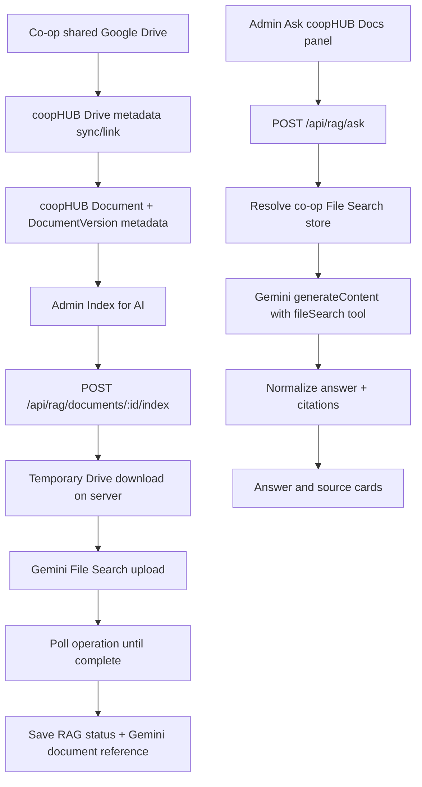

# Gemini File Search RAG Design

## Goal

Build a clean admin-only validation slice for document-grounded AI search in coopHUB.

The slice proves the real integration path for a co-op shared Google Drive, Gemini File Search, and coopHUB's document UX without introducing local RAG infrastructure.

## Product Boundary

The source of truth for files is each co-op's shared Google Drive. coopHUB stores document metadata, permissions, indexing state, and Gemini references. Gemini File Search owns document preprocessing, chunking, embeddings, retrieval, and grounding.

coopHUB will not store extracted chunks for this feature. Existing `DocumentChunk` and ingestion tables can remain for older functionality, but the Gemini File Search path must not depend on them.

## First Slice Scope

The first implementation is admin-only:

- Admin syncs or links Drive-backed document metadata into coopHUB.
- Admin manually indexes a Drive-backed document into Gemini File Search.
- Admin asks questions against the co-op's Gemini File Search store.
- coopHUB displays the grounded answer and available source/citation cards.
- Failed indexing is visible and retryable.

Member-facing document questions, automatic indexing, delete cleanup, and detailed permission-scoped stores are deferred until the integration is proven.

## Architecture

## Data Ownership

Google Drive stores:

- Original files
- Shared Drive folder structure
- Native Drive file permissions

Gemini File Search stores:

- Indexed document content
- Chunking output
- Embeddings
- Retrieval index

coopHUB stores:

- Co-op identity
- Drive file ID
- Drive folder ID or source folder path
- Drive web URL
- title, MIME type, modified time, size when available
- coopHUB category, visibility, committee, and tags
- Gemini File Search store name
- Gemini File Search document name
- RAG status, indexed timestamp, and indexing error
- optional query log preview and citation JSON

## Data Model

Add Gemini indexing fields to `DocumentVersion`, because an indexed RAG artifact belongs to a specific file version:

- `ragStatus String @default("not_indexed")`
- `ragStoreName String?`
- `ragDocumentName String?`
- `ragIndexedAt DateTime?`
- `ragIndexError String?`

Recommended `ragStatus` values:

- `not_indexed`
- `indexing`
- `indexed`
- `failed`
- `stale`
- `deleted`

The `Document` record can expose current-version status through API responses rather than duplicating state initially.

Add `RagStore` for per-co-op store resolution:

- `id`
- `cooperativeId`
- `scope`
- `displayName`
- `geminiStoreName`
- `embeddingModel`
- timestamps

The first scope is `documents`. The unique boundary should be one `documents` store per cooperative.

Optional query logging can reuse `PolicyAssistantQuery` for this slice or add a narrower `RagQueryLog` later. For the first implementation, logging a preview in `PolicyAssistantQuery` is acceptable if it avoids a larger migration.

## API Design

`POST /api/rag/documents/:documentId/index`

- Requires auth and document-management permission.
- Loads the document with `currentVersion`.
- Requires a Drive-backed source, preferably `sourceExternalId`.
- Resolves or creates the co-op's `documents` File Search store.
- Downloads the Drive file to a temporary path.
- Uploads the temporary file to Gemini File Search with display name and custom metadata.
- Polls the operation until completion or timeout.
- Deletes the temporary file in `finally`.
- Updates `DocumentVersion.ragStatus`, `ragStoreName`, `ragDocumentName`, `ragIndexedAt`, and `ragIndexError`.

`GET /api/rag/documents/:documentId/status`

- Requires auth and document-management permission.
- Returns current version RAG state for the document.

`POST /api/rag/ask`

- Requires auth and admin/document-management permission in this first slice.
- Accepts `{ question: string }`.
- Resolves the co-op's `documents` File Search store.
- Calls Gemini `generateContent` with a `fileSearch` tool pointed at that store.
- Uses a system instruction that answers only from retrieved coopHUB documents and says when the answer is not found.
- Normalizes citations and maps `documentId` metadata back to coopHUB documents when possible.

## Gemini Metadata

Index uploads should include custom metadata that helps map citations back to coopHUB:

- `cooperativeId`
- `documentId`
- `documentVersionId`
- `title`
- `category`
- `visibility`
- `committee`
- `driveFileId`
- `driveFolderId`
- `sourceSystem = google-drive`

For the admin-only slice, metadata is mainly for citation mapping and future filtering. It is not the primary security boundary.

## Security

The first slice is admin-only. All RAG endpoints require server-side auth and a document-management/admin permission before Gemini is called.

Do not rely on Gemini to enforce coopHUB authorization. Gemini File Search stores content by co-op, and coopHUB decides who can query a store or see source metadata.

Later member-facing rollout should add either permission-scoped stores or strict metadata filtering with post-retrieval citation filtering. That is deliberately out of scope for the first slice.

## UI Design

Add admin-only controls to the existing Documents page:

- AI index status badge on Drive-backed documents.
- `Index for AI` / `Retry AI Index` action.
- Compact `Ask coopHUB Docs` panel for admins.
- Answer state, loading state, error state, and source cards.

The panel should communicate scope as "Admin test: indexed co-op Drive documents" to avoid implying member-facing availability.

## Error Handling

Expected failures:

- Missing `GEMINI_API_KEY`.
- Missing Drive service account/config.
- Document has no Drive file ID.
- Drive download fails.
- Gemini upload or operation polling fails.
- Ask request has no indexed store/documents.
- Gemini answer fails.

Indexing failures update `ragStatus = "failed"` with a short error message. Ask failures return friendly JSON errors to the UI.

## Testing

Automated tests:

- RAG status mapping.
- Citation normalization.
- RAG request validation.
- Store resolver behavior with env-provided store and database-created store.
- Index endpoint rejects non-admin users.
- Ask endpoint rejects non-admin users.

Manual verification:

- Configure `GEMINI_API_KEY`.
- Configure or create a co-op File Search store.
- Link a Drive document into coopHUB.
- Index the document.
- Ask a question answered by the document.
- Ask a question not answered by the document.
- Confirm citations include useful source metadata.

## Rollout Order

1. Add schema fields and store model.
2. Add Gemini File Search client and store resolver.
3. Add Drive temporary download helper.
4. Add manual indexing service and endpoint.
5. Add ask service and endpoint.
6. Add admin UI controls and source cards.
7. Verify with one real Drive PDF.

## Deferred Work

- Member-facing ask UI.
- Automatic indexing on Drive sync/upload.
- Batch indexing whole folders.
- Delete/re-index lifecycle.
- Permission-scoped File Search stores.
- Folder-scoped query filters.
- Usage and cost dashboard.
